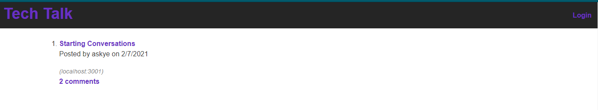
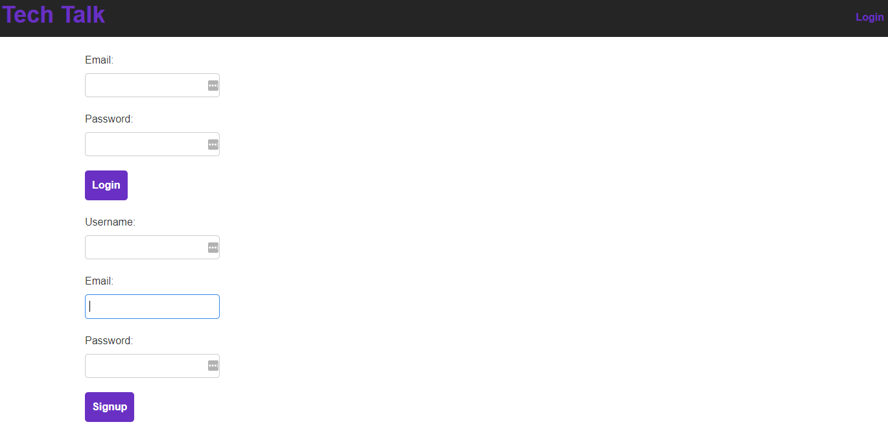

# tech-talk

## Description

This is a simple application where the focus is: conversations between developers of all backgrounds regarding a plethora of subjects. You will be able to view any current posts however to comment or create your own posts you will need to signup to the tech blog first. This is a great application to meet and discuss development topics that interest you!

## Table of Contents

* [Application Link](#applicationlink)
* [Usage](#usage)
* [Licenses](#licenses)
* [Contributing](#contributing)

## Application Link

Link to the Deployed application: [Tech-Talk](https://tech-talk-ya.herokuapp.com/)https://tech-talk-ya.herokuapp.com/.

## Usage 

Helpful Screenshots:

## Licenses

MIT

## Contributing

Made with ❤️ by: [GitHub](https://github.com/jasmineakbari)/jasmineakbari

If you would like to contribute to this work please feel free to submit any push/pull request, create issues or reach out to me at my email: jasmineakbari@yahoo.com.

